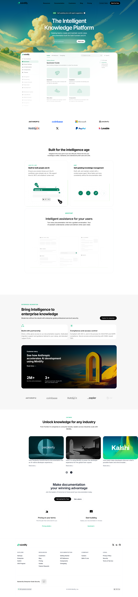

## Submission

**Live Demo**
https://guided-mintlify-26.netlify.app/

**GitHub Repository**
https://github.com/ashwin-bhanage/web-dev-cohort-2026/tree/main/assignments/mintlify-landing

---

## What Was Recreated

The following sections were recreated to closely match the Mintlify documentation-style landing page (desktop-first):

1. Top Navigation Bar
2. Hero Section (headline, description, email input + CTA, background illustration)
3. Documentation Preview Section
   - Static sidebar-style navigation
   - Main content preview cards
4. Trusted By / Logos
5. Feature Highlights (two-column layouts)
6. Intelligent Assistant / UI Preview
7. Enterprise Features Section
8. Case Studies / Customer Stories
9. Final Call-To-Action
10. Footer (multi-column links and legal info)

The focus was on **content structure, readability, layout accuracy, and hierarchy**, not interactivity or originality.

---

## Tech Stack & Constraints

- **HTML5**
- **CSS3**
- No JavaScript
- No Tailwind / CSS frameworks
- No animations or transitions
- Desktop-only layout

---

## Fonts Used

- Primary font: **Inter** (via Google Fonts)
- Font weights chosen to mirror documentation-style hierarchy (Regular, Medium, SemiBold)

---

## Color Palette (Approx.)

- Primary background: `#FFFFFF`
- Secondary background: `#F9FAFB`
- Primary text: `#111827`
- Secondary text: `#6B7280`
- Accent / CTA: `#6366F1`
- Borders / dividers: `#E5E7EB`
- Card backgrounds: `#FFFFFF`

Colors were visually sampled from the original Mintlify website and adjusted for consistency and contrast.

---

## Notes

- Emphasis was placed on documentation-style layout and readability.
- Sidebar navigation is static and non-interactive, purely for visual accuracy.
- Images and UI mockups were selected to closely resemble the original Mintlify visuals.
- Semantic HTML was used to reflect real documentation structure.
- Responsiveness was intentionally skipped as per assignment constraints.

---

## Screenshots

